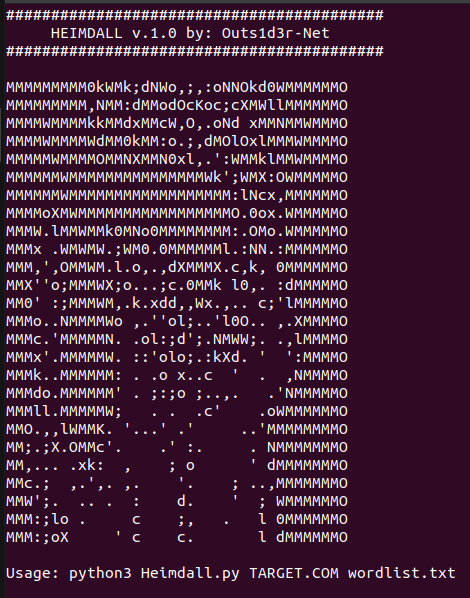

# Heimdall v1.0  
> The subdomains discovery !  

[](href="#")

## Advertence  
This software does not offer any kind of guarantee. Its use is exclusive for educational environments and / or security audits  
with the corresponding consent of the client. I am not responsible for its misuse or for any possible damage caused by it.  

## Installation  
#### Install dependencies:  
```
$ sudo apt update
$ sudo apt install -y git
$ git clone https://github.com/Outs1d3r-Net/Heimdall.git
$ cd Heimdall
```

## Usage  
```
$ python3 Heimdall.py TARGET.COM wordlist.txt
```
  
  
  
With great powers, great responsibilities !  


